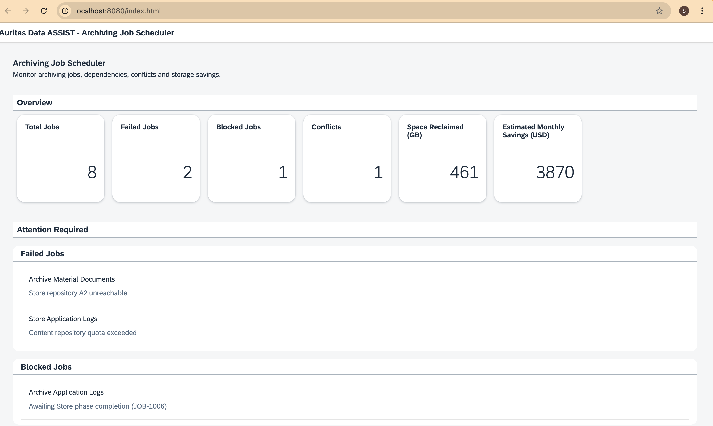

# Author: Shubham Kumar
# Auritas Data ASSIST - Archiving Job Scheduler

## Overview

This is a SAPUI5-based dashboard developed as part of the Auritas SAP BTP Architect assessment.

The objective of the application is to provide a single place where an SAP BTP admin can monitor archiving jobs, identify operational issues, and understand the business value generated through data archiving. I have also tried to make the UI based on SAP UI5/Fiori guidelines. 

The dashboard reads the provided jobs.json file and displays key operational and business metrics.

## Features Implemented

### KPI Overview

The dashboard provides an at-a-glance summary of:

- Total Jobs
- Failed Jobs
- Blocked Jobs
- Scheduling Conflicts
- Database Space Reclaimed
- Estimated Monthly Savings

### Attention Required Section

To help administrators focus on actionable items, the dashboard highlights:

- Failed Jobs
- Blocked Jobs
- Scheduling Conflicts

### Archiving Job Overview

A searchable table displays:

- Job Name
- System
- Archiving Object
- Phase
- Status
- Last Run
- Next Scheduled Run

### Conflict Detection

The application identifies scheduling conflicts when multiple jobs are scheduled for the same archiving object during overlapping execution windows.

## Technical Approach

This prototype uses:

- SAPUI5
- JSON Model
- Client-side calculations
- SAP Fiori design principles

No backend service was used for this implementation. All calculations are performed using the provided sample dataset.

## Assumptions

- The provided jobs.json file is used to display and manipulate data on dashboard.
- Scheduling conflicts are determined based on overlapping execution windows for the same archiving object.
- ROI is represented using the estimated monthly storage savings provided in the dataset.

## Application Screenshots

### Dashboard Overview

### Job Monitoring

